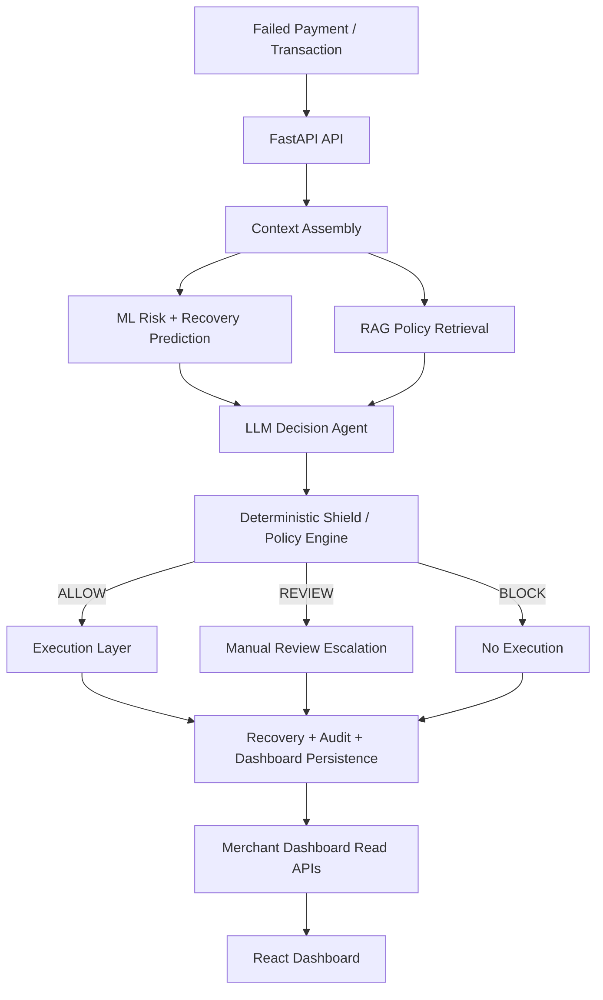

# RazorRecover

RazorRecover is a **risk-aware, constrained revenue-recovery decisioning system** for failed payment transactions. An LLM-based decision agent *recommends* a recovery action, a **deterministic Policy Engine authorizes** it, and an **Execution Layer performs** it — with the full decision trail persisted for audit and surfaced to merchants through a read-only dashboard.

RazorRecover is not "an AI agent that retries failed payments." It is an architecture and prototype for deciding **whether, how, and when** a failed payment should be recovered — with ML risk/recovery scoring, RAG policy context, a hard safety shield, and full merchant visibility of every decision.

## Problem

Payments fail for many reasons — insufficient funds, bank declines, authentication failures, network timeouts, gateway errors, expired cards, and more. Revenue recovery after failure is tricky:

- **Not every failure should be retried.** Blindly retrying creates customer friction (repeated charges, dunning fatigue) and can burn gateway/bank goodwill.
- **Failures differ in recovery potential.** Some are best retried immediately, some after a delay, some via an alternative payment method, and some should simply stop.
- **Some cases require review.** High-value transactions and high-risk cards should never auto-fly through the system — humans should look first.
- **Merchants need visibility and auditability.** A merchant should be able to see *why* a decision was made, which policy version authorized it, and what actually executed — not just a final status.

## Solution

RazorRecover treats recovery as a **decision pipeline with a hard safety boundary**. An AI agent alone never executes anything; its output is only a recommendation that a deterministic engine must authorize.

```
Failed Payment
    ↓
Context / Data
    ↓
ML Risk + Recovery Prediction
    ↓
RAG Policy Context
    ↓
LLM Decision Agent
    ↓
Deterministic Shield / Policy Engine
    ↓
Execution
    ↓
Recovery + Audit
```

### AI recommends. Policy authorizes. Execution performs.

| Layer | Responsibility | Outcome |
| --- | --- | --- |
| ML models | Score each failed transaction | `risk_score`, `recovery_probability` |
| RAG | Retrieve merchant-relevant recovery/policy knowledge | Top-k context chunks |
| LLM decision agent | Recommend one action from a fixed allowed set | `AgentDecision` (structurally validated) |
| Deterministic Shield | Authorize or reject the recommendation with no LLM involvement | `ALLOW` / `REVIEW` / `BLOCK` + per-rule rationale |
| Execution layer | Perform the authorized action (and only the authorized action) | Persisted `RecoveryAttempt` + status |
| Audit trail | Record the full decision trail | Immutable `AuditLog` per evaluation |

The allowed actions the agent may recommend are: `RETRY_NOW`, `DELAYED_RETRY`, `ALTERNATIVE_PAYMENT`, `CUSTOMER_NOTIFICATION`, `MANUAL_REVIEW`, `STOP`. Only a **deterministic `ALLOW`** decision authorizes execution; `REVIEW` escalates to human review and `BLOCK` means nothing runs. The engine fails closed: missing data or an unexpected error can never accidentally authorize an action.

### A focused prototype, not a replacement

Razorpay as a payments platform already ships recovery, risk, and agentic capabilities (retries, Smart Retries, risk tools, and more). RazorRecover does **not** claim that Razorpay lacks AI-driven recovery or payment retries, and it does **not** replace Razorpay's platform capabilities. It is a **focused architecture/prototype** demonstrating how a constrained, risk-aware recovery-decisioning system (ML → RAG → LLM → deterministic shield → execution → audit) can be built end-to-end with full merchant visibility — a reference implementation of the decision boundary and the observability around it.

> The demo policy thresholds, RAG documents, and gateway/notification providers shipped in this repository are synthetic and clearly labeled as such — they are **not** real Razorpay policies or integrations.

## Key Features

- **Synthetic payment dataset generation** — seeded, reproducible generation of merchants, customers, and failed transactions across realistic failure categories (`insufficient_funds`, `bank_declined`, `authentication_failed`, `network_timeout`, `gateway_error`, `expired_card`, `limit_exceeded`, `unknown`), persistable to PostgreSQL via `scripts/generate_synthetic_data.py`.
- **ML risk prediction** — a logistic-regression model predicting `risk_score` ∈ [0,1] (probability of loss) from an explicit, auditable feature set with **no target leakage** (`scripts/train_ml_models.py`).
- **ML recovery-probability prediction** — a companion model predicting `recovery_probability` ∈ [0,1]. Both models share a documented feature builder whose leaked fields are excluded and tested.
- **RAG policy retrieval** — a Qdrant-backed vector store with pluggable embeddings (deterministic local hash provider by default; Ollama optional) over a synthetic, clearly-disclaimed demo knowledge base.
- **Merchant-scoped knowledge** — knowledge documents may carry a `merchant_scope`; retrieval can be filtered per merchant so the agent only sees relevant context.
- **LLM decision agent** — an Ollama-backed agent (provider abstraction allows swapping) that consumes ML + RAG + transaction context and returns a *structurally validated JSON recommendation* from the fixed allowed-action set. It never executes anything.
- **Deterministic Shield policy engine** — 11 composable, deterministic rules that authorize the recommendation without any LLM involvement, honoring per-merchant policy and fail-closing on missing data (`src/razor_recover/shield/rules.py`).
- **Recovery execution workflow** — executes **only** on `ALLOW` decisions, with idempotency/in-flight guards, a deterministic mock payment gateway (`SUCCESS`/`FAILED`/`TIMEOUT`), delayed retries recorded as scheduled, and a mock notification provider. No real payment system is contacted.
- **Audit logging** — each evaluation persists an immutable audit event capturing ML scores, RAG references, the LLM's requested action and rationale, the policy decision/version, every per-rule result, and the final execution status.
- **Transaction investigation API** — paginated, filterable transaction listing (`status`, merchant, customer, payment method, gateway, failure code, date range, free-text search) plus a full transaction-detail read model.
- **Merchant dashboard read APIs** — read-only `/summary` (KPIs, decision outcomes, risk buckets, monetary aggregates) and `/audit` (paginated audit trail, transaction-filterable) endpoints. Read endpoints never mutate state.
- **React dashboard** — a React 19 + Vite + TypeScript merchant UI with:
  - **Recovery Command Center** — KPIs, recovery-outcome chart, risk distribution, recovery probability, insights, recent failed payments.
  - **Transactions Investigation** — filterable/paginated transaction table with summary strip.
  - **Transaction Details** — transaction overview, failure context, AI analysis, shield decision, recovery history, audit trail, and decision timeline.
  - **Audit Logs** — *in progress*: the backend API and its integration tests are complete; the frontend screen is under active development.

## Architecture



### Components

| Path | Responsibility |
| --- | --- |
| `src/razor_recover/api/` | FastAPI transport; thin endpoints that delegate to services |
| `src/razor_recover/workflow/` | `RecoveryOrchestrator` — the coordinate pipeline `fetch → ML → RAG → LLM → Policy → Execution → persist → audit` |
| `src/razor_recover/brains/ml/` | Feature builder, risk + recovery models, training/evaluation, lazy-loading prediction service |
| `src/razor_recover/brains/rag/` | Embeddings, Qdrant vector store, retriever, chunking, synthetic knowledge base, seeding |
| `src/razor_recover/brains/llm/` | Decision agent, Ollama provider, prompt building, strict output parsing/validation |
| `src/razor_recover/shield/` | Deterministic policy engine, 11 rules, evaluator, `ALLOW`/`REVIEW`/`BLOCK` decision contract |
| `src/razor_recover/execution/` | Recovery execution, retry service, mock payment gateway, notification service |
| `src/razor_recover/services/read/` | `DashboardReadService` — all dashboard SELECT logic (never mutates) |
| `src/razor_recover/synthetic/` | Synthetic dataset generation and persistence |
| `src/razor_recover/db/models/` | ORM models: `Transaction`, `Customer`, `Merchant`, `Policy`, `RecoveryDecision`, `RecoveryAttempt`, `AuditLog` |
| `frontend/` | React 19 + Vite + TypeScript merchant dashboard |
| `scripts/` | Data generation, ML training, vector-store seeding CLIs |
| `alembic/` | Database migrations (PostgreSQL) |
| `docker/` | `docker-compose.yml` (Postgres 16 + Qdrant); Dockerfile (placeholder) |

### Data model

- `transactions` — a payment that failed and may be recovered (external id, amount/currency, status, failure code/reason, payment method, gateway, attempt number).
- `customers` / `merchants` — parties involved in a transaction.
- `policies` — stored deterministic policy definitions (the engine also accepts policy values directly).
- `recovery_decisions` — the outcome of one ML + RAG + LLM + shield evaluation (action, outcome, risk score, policy version, rationale).
- `recovery_attempts` — one executed attempt of an authorized recovery action and its status.
- `audit_logs` — immutable audit events with actor, action, and a JSON detail payload.

## Getting Started

### Prerequisites

- Python 3.10+ and Docker (PostgreSQL + Qdrant run in Docker)
- Node.js 18+ for the frontend

### 1. Start the infrastructure

```bash
docker compose -f docker/docker-compose.yml up -d
```

This starts PostgreSQL (`localhost:5433`) and Qdrant (`localhost:6333`).

### 2. Backend

```bash
python -m venv .venv
.venv\Scripts\activate        # Windows:  source .venv/bin/activate
pip install -r requirements.txt
pip install -e .

cp .env.example .env          # adjust values as needed
alembic upgrade head          # apply database migrations

python scripts/generate_synthetic_data.py   # generate + persist demo dataset
python scripts/train_ml_models.py           # train risk + recovery models (writes models/*.joblib)
python scripts/seed_vector_db.py            # seed the synthetic knowledge base into Qdrant
```

Run the API:

```bash
uvicorn razor_recover.main:app --reload
```

Interactive API docs are available at `http://localhost:8000/docs` when `DEBUG=true`.

### 3. Frontend

```bash
cd frontend
npm install
npm run dev
```

The dashboard runs at `http://localhost:5173` and calls the backend at `http://localhost:8000` by default (override with `VITE_API_BASE_URL`).

## API Overview

All routes are mounted under `/api/v1`.

| Method | Path | Description |
| --- | --- | --- |
| `GET` | `/health` | Service health |
| `POST` | `/recovery/evaluate` | Run the full recovery workflow for one transaction |
| `GET` | `/transactions` | List transactions (filter + paginate) |
| `GET` | `/transactions/{id}` | Full persisted transaction detail |
| `GET` | `/summary` | Dashboard summary metrics |
| `GET` | `/audit` | Paginated audit trail (optionally filtered by transaction) |

See [`docs/api/API.md`](docs/api/API.md) for the full reference.

## Testing

```bash
pytest
```

Unit tests run against in-memory SQLite; integration tests require PostgreSQL/Qdrant and skip automatically when those services are unavailable. See `tests/` (`unit/` for feature coverage, `integration/` for database, RAG, dashboard, and end-to-end workflow tests).

## Project Status

The backend vertical slice is complete: synthetic data → ML → RAG → LLM → Shield → Execution → Audit, with read APIs and the React dashboard. The **Audit Logs frontend screen is in progress** (backend API and tests are done). CI/CD workflows and the Docker image are placeholders.

## Disclaimer

All policies, knowledge-base documents, model training data, thresholds, and gateway/notification providers in this repository are **synthetic demo material** for the RazorRecover prototype. They are not real Razorpay policies, limits, or integrations, and nothing here contacts a real payment system.